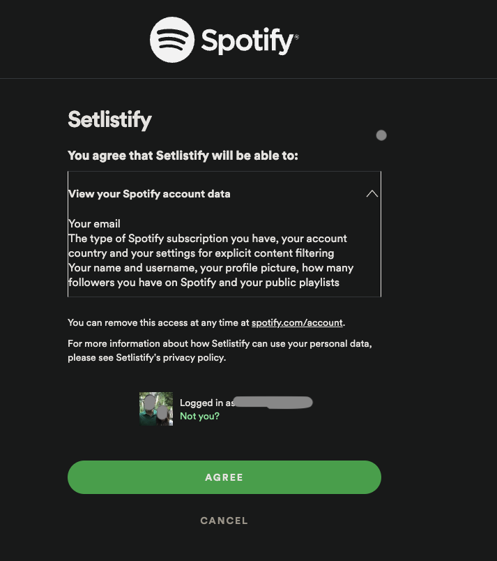
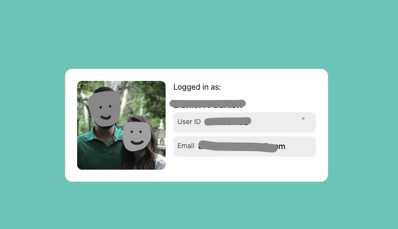

# spotify-profile-demo

A couple years ago, I built an app to search a musical artist's setlist and it would then create a Spotify playlist on my account. This was useful when going to concerts and having an idea of what you were going to hear. 
Fast forward a little bit and Covid had shut down all gatherings like concerts. The repo (private now) went stale. This is to recreate it but make it better too.

Golden Path Flow:
- User auth's Spotify token
- User searches for an artist
- User selects a venue/set
- Show the user the list of songs
- Create playlist on Spotify of these songs
- Provide user with a link to the playlist on their account

Spotify Auth Flow:
<!-- Following: https://developer.spotify.com/documentation/web-api/howtos/web-app-profile -->
- Check if the URL has a callback query string. 
- If we don't have the data necessary, send to this auth page (note app name near the top) and get an [authorization code with pkce flow](https://developer.spotify.com/documentation/web-api/tutorials/code-pkce-flow)

- If user auths, we will get the callback querystring
- Use the code to access Spotify token API
- Get user's profile data
- Populate our webpage. Added some bootstrap styling and remove some personal info

# TODO
- Add the setlist API setup back
- Add setlist search and display back
- Add setlist selection/parse back
- Add playlist creation back