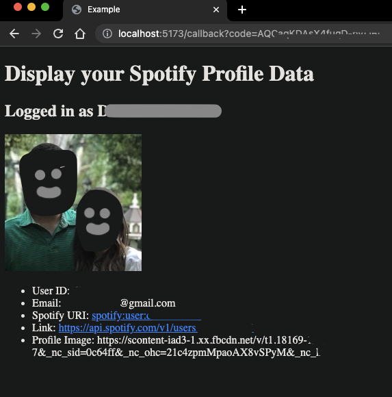

# spotify-profile-demo
Following: https://developer.spotify.com/documentation/web-api/howtos/web-app-profile

And getting an [Authorization Code with PKCE Flow](https://developer.spotify.com/documentation/web-api/tutorials/code-pkce-flow)

Flow:
- Check if the URL has a callback query string
- If not, redirect to spotify auth page
- If user auths, we will get the callback querystring
- Use the code to access Spotify token API
- Get user's profile data
- Populate interface

Successful Flow (blurred personal info from sharing)

And then some styling and unnecessary data removed

No callback, send to this auth page (note app name near the top)
